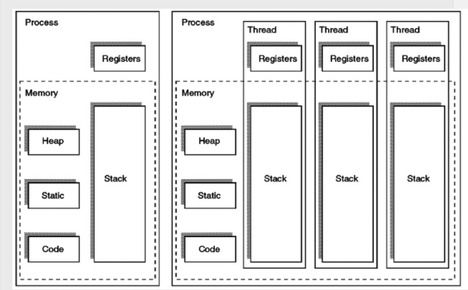
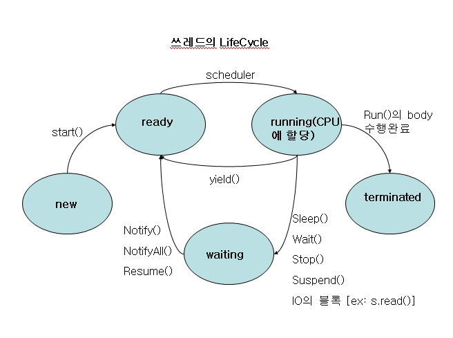

## 쓰레드
### 쓰레드는 프로세스를 구성하는 하나의 작업단위이다.
### 프로세스는 하나의 프로그램 어플리케이션이라 할 수 있고,
### 쓰레드는 이 어플리케이션에서 실행되는 하나의 흐름 단위라고 할 수 있다.
### 쓰레드의 방식은 실글 쓰레드 , 멀티 쓰레드로 나뉠 수 있다.
### 멀티쓰레드는 보통 멀트프로세스와의 비교를 많이 하게 되는데,
### - 멀티프로세스는 각 프로세스가 독립적으로 메모리를 할당 받기 때문에,
###     메모리를 공유 할 수 없고, 공유하기 위해서는  IPC(프로세스간 통신)
### - 멀티쓰레드는 한 프로세스 안에 쓰레드를 여러개 실행시키는 방식으로 각 쓰레드는 별도의 stack 영역을 갖지만,
###     heap 영역이나, data 영역, code 영역은 공유해서 사용한다. stack 영역은 해당 쓰레드를 위한 스텍 생성을 할 뿐 공유하지는 않는다.

##### 이미지 블로그 출처 : https://3dmpengines.tistory.com/2003
##### 이미지 원본 출처 : http://www-01.ibm.com/support/knowledgecenter/SSLTBW_1.12.0/com.ibm.zos.r12.euvmo00/euva3a00451.htm
### 때문에 프로그램은 하나의 객체를 생성하는데 메모리 자원과 큰 리소스 소모가 크므로
### 멀티 쓰레드를 사용하는 것이 더 효율적이다.
### 그러나 멀티쓰레드는 자원을 공유하기에 , Thread-safe 하지 않다(안정성이 보장되어 있지 않다.)
### 때문에 가장 많이 쓰는 방법으로 
### 1.Synchronized 를 사용하게 되는데, Synchronized 를 쓰레드하나가 한 자원에 접근하여 일을 처리하기까지의 안정성을 보장한다.
### 하지만 이 때문에 성능의 저하를 불러올 수 있어 주의가 필요하다.
### 2.wait(), notify() 사용해서 임계영역에서 wait()과 notify() 메소드를 사용하여, 임계영역에 접근하는 쓰레드를 lock()하고 unlock()하는 것이 가능하다.
### 3.join() 을 사용하여 해당 쓰레드가 종료될 때까지 실행을 멈출 수 있다. ex) thread1.start(); thread2.start(); thread1.join(); thread2.join();
### 4.Spring 에서 제공하는  AOP 방법/ @Transactional로 처리를 해줄 수 있음. 해당 어노테이션으로 AOP를 설정하면 메소드를 실행하기 전 프록시를 통해 lock, unlock 처리가 가능하다.

### 쓰레드를 생성하는 방법은으로는
### 1.Thread 클래스를 상속받아 run() 메소드를 오버라이딩한 뒤에 start() 로 실행
### 2.Runnable 인터페이스를 구현한뒤 run()메소드를 오버라이딩한 뒤에 start()로 실행
### 3.익명클래스(함수형으로) 바로 구현해 사용
### 4.Thread Pool 이용, Executors의 다양한 정적 메서드를 통해 ExecutorService 구현객체를 만들어 사용

### 쓰레드의 우선순위는 getPriority(), setPriority() 로 반환하거나 설정할 수 있다.

### 참고 블로그 :
[멀티프로세스 vs 멀티쓰레드](https://haloworld.tistory.com/141)
[프로세스&쓰레드와 메모리(스택, 레지스터)](https://3dmpengines.tistory.com/2003)
[[Java] Thread Pool(스레드 풀)](https://limkydev.tistory.com/55)
[[Java] Thread 생성 방법과 Life Cycle](https://goodncuteman.tistory.com/20)

---

## TCP(Transmission Control Protocol) / UDP(User Datagram Protocol)
### TCP 는 연결지향프로토콜로써 실시간으로 통신을 주고받을 수 있으며, 신뢰성이 높다.
### UDP 는 비연결지향프로토콜로써 신뢰성이다소 떨어지지만, 속도가 빠르다.

### 인터넷 프로토콜 스택의 4계층은
### 제일 위부터
|(애플리케이션) 애플리케이션 계층 - HTTP, FTP |
|:-------------------------:|
|(os) 전송 계층 - TCP, UDP        |
|(os) 인터넷 계층 - IP             |
|네트워크 인터페이스 계층 - LAN장비들|

---
### TCP 특징(전송 제어 프로토콜)
1. 연결지향 - TCP 3 way handshake(가상연결->물리적연결이아님)
2. 데이터 전달 보증 (메시지를 보낼때 패킷이 중간에 누락되면 사용자가 알 수 있다.)
3. 순서 보장
### 따라서 신뢰할 수 있는 프로토콜이며, 현재는 대부분 TCP 를 사용한다.
### TCP 3 way handshake 는  첫번째로 클라이언트에서 서버로 SYN(Synchronize)이라는 연결해달라는 메시지를 보내고
### 두번째로 서버에서 클라이언트에게 응답으로 SYN+ACK(응답) 메시지를 보낸다.
### 세번째로 마지막으로 클라이언트는 서버에 응답 ACK 를 보내는 과정으로 총 3번을 주고받아 연결시킨뒤에 데이터 전송을 시작한다.
### 이때 요즘에는 세번째 ACK 를 보내면서 데이터를 전송하기도 한다. 
### 이러한 3 way handshake 방식으로 연결을 보장한다.
### TCP 는 클라이언트가 서버로 데이터를 전송하면 서버는 클라이언트에게 잘받았다는 응답을 해주기에 데이터 전송이 보장된다.
### TCP 는 패킷1, 패킷2, 패킷3 순서로 서버에 보내고 만약 서버에 순서가 바장되지 않고 들어오게된다면
###   서버는 다버리고 잘못된부분부터 클라이언트에게 다시보내 클라이언트는 확인후 잘못된 부분부터 서버로 다시 전송한다
###      이런방식으로 TCP 는 정보전달의 순서를 보장해준다.
### 이런것들이 가능한 이유는 TCP 데이터안에는 전송정보들이(순서,목적지,출발지,PORT 등) 추가되어 있기에 가능한 것이다.
---

### UDP 특징(사용자 데이터그램 프로토콜)
1. 기능이 거의 없다.
2. 데이터 전달 보증x
3. 3 way handshake x
4. 순서 보장 x
5. 데이터 전달 및 순서가 보장되지 않지만, 단순하고 빠르다.
6. IP와 거의 같지만 PORT 와 체크섬 정도가 추가된것이 다른점이다.
7. 애플리케이션에서 추가 작업 필요하다.
#### 추가적으로 한줄 정리하면 TCP, UDP 둘다 IP 에서  PORT 가 추가된 IP 위에있는 계층
### TCP 는 3 way handshake 및 담는 정보도 많아 속도도 느리고 데이터 양도 크다는 단점이 있다.
### 때문에 성능 최적화 하기에는 UDP 가 더 좋기에 최근에 각광을 받고 있다.
### 최근에 나온 HTTP3 스펙이 공개되었는데 Http3는 UDP 프로토콜을 쓰면서 최적화하고 있어 각광받고있다.

### 참고 :
[인프런_모든 개발자를 위한 HTTP 웹 기본 지식](https://www.inflearn.com/course/http-%EC%9B%B9-%EB%84%A4%ED%8A%B8%EC%9B%8C%ED%81%AC/dashboard)
[김형수선생님의_수스어드밴스]()

---
### String / StringBuffer / StringBuilder
### String 은 불젼성을 갖고있어 새로운 문자열이 추가될때마다 새로운 heap 메모리에 영역을 할당한다.
### StringBuffer 과 StringBuilder 는 가변성을 가지고 있어 append(), delete() 등의 동일 객체내에서 문자열을 변경하는 것이 가능하다.
### StringBuffer 는 내부적을 Synchronize 를 사용하고 있어 Thread-safe 하다.
### 그러나 단일 쓰레드 환경에서는 StringBuilder 가 StringBuffer 보다 성능이 뛰어나다.
### 참고 블로그 :
[[Java] String, StringBuffer, StringBuilder 차이 및 장단점](https://ifuwanna.tistory.com/221)
[자바 어플리케이션의 성능 향상](https://javacan.tistory.com/entry/7)

---

## Join
### Join 의 종류는 크게 4가지가 있다.
1. 교집합인 Inner Join (Select 컬럼명, 컬럼명 From 테이블 A (Inner)Join 테이블 B On A.조인키컬럼 = B.조인키컬럼)
2. ( (A ∩ B) ∪ (A - B) ) Left Outer Join (Select 컬럼명, 컬럼명 From 테이블 A Left Outer Join 테이블 B On A.조인키컬럼 = B.조인키컬럼)
3. ( (A ∩ B) ∪ (A - B) ) Right Outer Join (Select 컬럼명, 컬렴명 From 테이블 A Right Outer Join 테이블 B On A.조인키컬럼 = B.조인키컬럼)
4. 합집합인 Full Outer Join (Select 컬럼명, 컬럼명 From 테이블 A Full Outer Join 테이블 B On A.조인키컬럼 = B.조인키컬럼)

### 참고 블로그 :
[테이블 조인 종류(Table Join Type)](https://sparkdia.tistory.com/17)