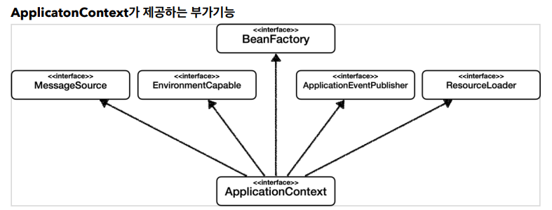
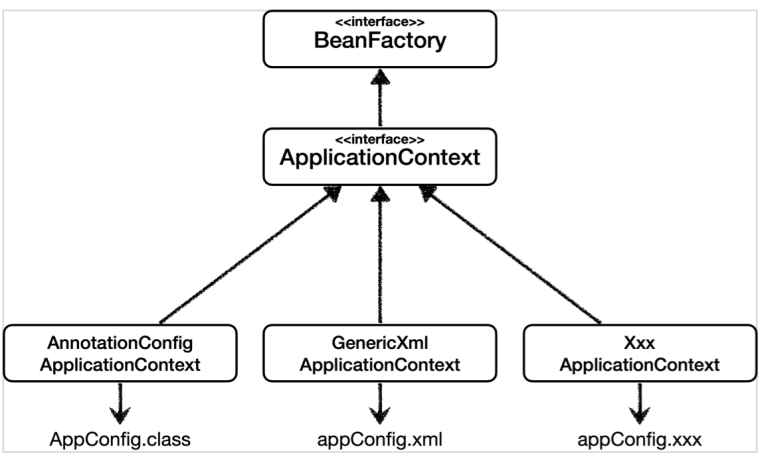
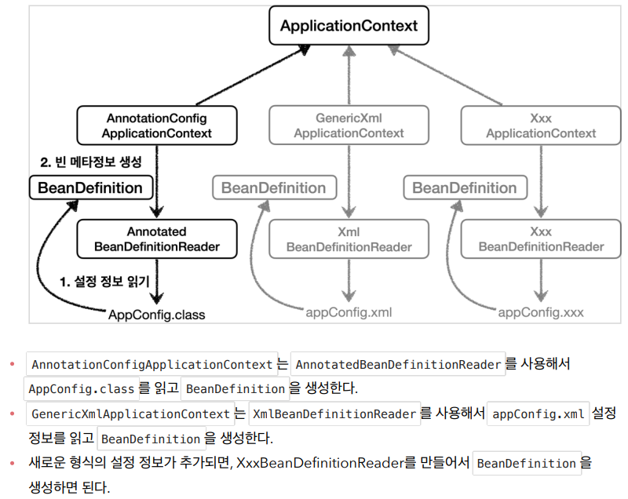

### 실습
---

---
#### 예제 만들기
1. 요구사항
- 회원
- 회원은 가입하고 조회할 수 있다.
- 회원은 일반과 VIP 두 등급이 있다.
- 회원 데이터는 자체 DB 를 구축 할 수 있고, 외부 시스템과 연동할 수 있다.(미확정)
- 정책
- 회원은 상품을 주문할 수 있다.
- 회원 등급에 따라 할인 정책을 적용할 수 있다.
- 회원 정책은 모든 VIP 는 1000 원 할인해주는 고정 금액 할인을 적용해달라(나중에 변경 될 수 있다.)
- 할인 정책은 변경 가능성이 높다. 회사의 기본 할인 정책을 아직 정하지 못했고, 오픈 직전까지 고민을 미루고 싶다.
- 할인 정책은 최악의 경우 할인을 적용하지 않을 수 도 있다.(미확정)
2. 설계
- 회원 도메인 설계
- 회원 도메인 협력 관계 (기능)
- 회원 클래스 다이어그램 (클래스)
- 회원 객체 다이어그램 (인스턴스)
- 
- 주문과 할인 도메인 설계
- 주문 도메인 협력,역할,책임(기능,역할)
- 주문 도메인 전체(역할,구현)
- 주문 도메인 클래스 다이어그램
---

#### 객체 지향 원리 적용
1. 새로운 할인 정책
- 주문한 금액의 % 를 할인해주는 새로운 정률 할인 정책을 추가하자
2. 새로운 할인 정책 적용과 문제점
- DIP 구체에 의존하지말고 추상에 의존해라(interface)
3. 관심사 분리 (사용 영역과 구성 영역의 분리)
- AppConfig(구성 영역) 의 출현 (주입을위한 관리 팩터리 클래스 -> 생성자 주입) 
- AppConfig 의 출현으로 DIP 원칙을 온전히 지킬 수 있다.
4. AppConfig 리팩터링
- AppConfig 의 중복도 있고, 역할에 따른 구현이 잘 보이징 않는다! (즉 역할과 구현이 한눈에 보이도록 리팩터링해라! 메서드화 -> InteliJ ctrl+alt+m 활용가능)
5. 새로운 구조와 할인 정책 적용
- FixDiscountPolicy 에서 RateDiscountPolicy 로 바꿔보자
- AppConfig 를 통해 사용 영역과 구성 영역이 나뉘어 졌기에 AppConfig 만 고치면 된다.
6. 좋은 객체 지향 설계의 5가지 원칙 적용
- SRP , DIP , OCP 적용
- SRP 를 위해 관심사를 분리시켰다. 구현객체를 생성하고 연결하는 책임은 AppConfig 가 담당
- DIP 를 위해 객체는 (클라이언트 코드) 는 추상화에 의존하고 AppConfig 에서 의존관계를 주입
- OCP 룰 위해서 구성영역과 사용영역으로 나누어 정책 변경시에 클라이언트 코드는 변경에 닫혀 있도록 만들었다.
---
7. IoC , DI 그리고 컨테이너
- 제어의 역전(IoC) : 구현객체가 스스로 제어의 흐름을 제어하는 것이 아닌, AppConfig 가 프로그램의 제어 흐름을 가져간다.
- 즉 프로그램의 흐름을 자신이 하는것이아닌, 외부에서 하는것이 제어의 역전이다.
- 그리고 이 제어의 역전이 프레임워크와 라이브러리의 차이이다. 프레임워크는 제어의 역전을 가져간다. (ex: Junit)
- 작성한 코드에서 제어를 담당한다면 그것은 라이브러리이다.
- 
- 의존관계 주입 DI(Dependency Injection) : 정적인 클래스 의존 관계와(앱을 실행하지 않아도 알수있는 눈에보이는 의존관계들) 와 실행 시점에 결정되는 동적인 객체(인스턴스) 의존 관계를 분리해서 생각해보자.
- 실생 시점에 결정되는 동적인 객체 인스턴스 의존 관계는 외부에서 실제 구현 객체를 생성하고 객체간 관계를 맺어준다(AppConfig). 이를 DI 라고 한다.
- 의존관계 주입을 사용하면 정적인 클래스 의존 관계의 변경없이 동족인 객체 인스턴스 의존 관계의 변경으로 관계를 변경 시킬 수 있다.
- 
- IoC 컨테이너와 DI 컨테이너 : AppConfig 처럼 객체를 생성하고 관리하면서 의존관계를 연결해 주는것을 IoC 컨테이너 DI 컨테이너라고 한다.
---
8. 스프링으로 전환하기
- @Configuration
- @Bean
- ApplicationContext
- AnnotationConfigApplicationContext
- getBean
```java
ApplicationContext applicationContext = new AnnotationConfigApplicationContext(AppConfig.class);
MemberService memberService = applicationContext.getBean("memberService", MemberService.class);
OrderService orderService = applicationContext.getBean("orderService", OrderService.class);
```
---

#### 스프링 컨테이너와 스프링 빈 절차
1. 스프링 컨테이너 생성
```java
// 스프링 컨테이너 생성
ApplicationContext applicationContext = new AnnotationConfigApplicationContext(AppConfig.class);
```
- ApplicationContext 를 스프링 컨테이너라 한다.
- ApplicationContext 는 인터페이스이다. 따라서 XML 기반으로 만들 수도 있고, java @에노테이션 기반의 자바설정 클래스를 만들 수도 있다.
- 또한 ApplicationContext 는 BeanFactory(최상위) 를 상속받는다.
1) 스프링 빈 등록
- 스프링 컨테이너에 있는 스프링 빈 저장소에 @Bean 에노테이션이 붙은 객체를 담게 된다.
- 디폴트로는 메서드 이름으로 저장이 되지만 @Bean(name = "설정") 으로 이름을 바꿀수 있다.
- 단 @Bean 이름은 중복 되면 안된다!
2) 스프링 빈 의존관계 설정
- @Bean 객체를 생성 (즉 @Bean 이 스프링 빈 저장소에 저장됨)
3) 스프링 빈 의존관계 설정 - 완료
- 스프링이 @Bean 간의 동적인 의존관계를 연결시켜줌(참조 값들이 연결됨)
- 스프링은 설정 정보를 참고해서 의존관계 DI 를 주입한다.
- 싱클톤 컨테이너방식으로 완료하게 됨
4) 정리
- 스프링은 빈을 생성하고, 의존관계 주입 단계가 나누어져있다.
- 빈을 생성한뒤에 의존관계를 주입하게 된다.
- 자바 코드로 스프링 빈을 등록하면 생성자를 호출하면서 의존관계 주입도 한번에 처리된다. (그렇지만 정석은 스프링 라이프사이클은 등록과 주입 두단계로 나뉘어져있다.)


2. 컨테이너에 등록된 모든 빈 조회
ex) ApplicationContextInfoTest.java
```java
    @Test
    @DisplayName("모든 빈 출력하기")
    void findAllBean() {
        String[] beanDefinitionNames = ac.getBeanDefinitionNames();
        for (String beanDefinitionName : beanDefinitionNames) {
            Object bean = ac.getBean(beanDefinitionName);
            System.out.println("name = " + beanDefinitionName+", Object = "+bean);
        }
    }
```
```java
    @Test
    @DisplayName("내가 짠 애플리케이션 빈 모두 출력하기")
    void findApplicationBean() {
        String[] beanDefinitionNames = ac.getBeanDefinitionNames();
        for (String beanDefinitionName : beanDefinitionNames) {
            BeanDefinition beanDefinition = ac.getBeanDefinition(beanDefinitionName);
            // ROLE_APPLICATION 은 스프링이 등록한 것이아닌 내가 등록하거나 외부라이브러리가 등록한것
            // ROLE_APPLICATION 은 직접 등록한 애플리케이션 빈
            // ROLE_INFRASTRUCTURE 은 스프링이 내부에서 사용하는 빈
            if (beanDefinition.getRole() == BeanDefinition.ROLE_APPLICATION) {
                Object bean = ac.getBean(beanDefinitionName);
                System.out.println("name = " + beanDefinitionName+", Object = "+bean);
            }
        }
    }
```
- ac.getBeanDefinitionNames() : 스프링에 등록된 모든 빈 이름을 조회한다.
- ac.getBean() : 빈 이름으로 빈 객체(인스턴스) 를 조회한다.
- ac.getBeanDefinition(빈 이름) : 스프링에 등록된 빈을 꺼낼 수 있다.
- 스프링에서 사용하는 빈은 getRole() 로 구분할 수 있다.


3. 스프링 빈 조회 - 기본방법
ex) ApplicationContextBasicFindTest.java
- ac.getBean(빈이름, 타입)
- ac.getBean(타입)


4. 스프링 빈 조회 - 동일한 타입이 둘 이상시에는 중복 오류가 발생한다.
ex) ApplicationContextSameBeanFindTest.java
- ac.getBeansOfType() 해당 타입의 모든 빈을 조회할 수 있다.


5. 스프링 빈 조회 - 상속관계
ex) ApplicationContextExtendsFindTest.jav
- 부모 타입으로 조회하면, 자식 타입도 함께 다 조회된다.(대원칙)
- 그래서 모든 자바 객체의 부모인 Object 타입으로 조회하면, 모든 스프링 빈을 조회한다.


6. BeanFactory 와 ApplicationContext
- <<interface>> BeanFactory <- <<interface>> ApplicationContext <- AnnotationConfigApplicationContext
- ApplicationContext 는 BeanFactory 를 상속받을 뿐만 아니라
- 메시지 소스를 활용한 국제화 기능
- 환경변수
- 애플리케이션 이벤트
- 편리한 리소스 조회 룰 상속 받는다.

- BeanFactory 를 직접 사용할 일은 거의 없다. 부가기능이 포함된 ApplicationContext 를 사용한다.


7. 다양한 설정 형식 지원 - 자바코드 , XML
- 스프링 컨테이너는 다양한 형식의 설정 정보를 받아드릴 수 있게 유연하게 설계되어있다.
- 자바 코드 , XML , Groovy 등

- XML 활요 ex) XmlAppContext.java , appConfig.xml


8. 스프링 빈 설정 메타 정보를 담고 있는 - <<interface>>BeanDefinition
- BeanDefinition 을 설정 메타정보라 하고 @Bean , <bean> 당 하나씩 메타정보가 생성된다.
- 스프링 컨테이너는 이 메타정보를 기반으로 스프링 빈을 생성한다. 즉 스프링 컨테이너는 추상화인 BeanDefinition을 의존한다.

- BeanClassName
- factoryBeanName
- factoryMethodName
- Scope
- lazyInit
- 아래와 같은 빈 라이프 사이클도 포함되어있다.
- initMethodName
- DestroyMethodName
- Constructor arguments, Properties
- ***추가적으로 ApplicationContext 로는 getBeanDefinition 을 사용할 수 없다. AnnotationConfigApplicationContext 처럼 구현체로 사용할 수있다.
- 스프링 빈을 만드는 방법으로는 두가지 방식이있는데  직접적으로 빈을 등록하는 방법, 팩터리 빈을 통해서 등록하는 방식이다.
- xml 방식은 직접 빈을 등록하는 방식으로 GenericXmlApplicationContext 으로 beanDefinition을 꺼내면 클래스는 무엇인지 볼 수 있다.
- @에노테이션 방식은 우회해서 등록하는 팩터리 메서드 방식으로 AnnotationConfigApplicationContext 으로 beanDefinition을 꺼내면 클래스는 null이다.


---
#### 싱글톤 컨테이너
1. 웹 애플리케이션과 싱글톤
- 웹은 고객의 요청이 무수히 많은 애플리케이션이다. 때문에 싱글톤으로 하나만 생성해서 공유해서 쓰는것이 좋다.

2.싱글톤 패턴
- 클래스의 인스턴스가 딱 1개만 생성되는 것을 보장하는 디자인 패턴이다.
- 스프링 컨테이너를 사용하면 스프링 컨테이너는 기본적으로 싱글톤으로 객체를 관리해준다! 그래서 스프링은 웹에 특화되어있는 프레임워크이다.
- 스프링을 쓰지않은 싱글톤의 단점
- 싱글톤 패턴을 구현하는 코드 자체가 많이 들어간다.
- 의존관계상 클라이언트가 구체 클래스에 의존한다 -> DIP 위반, OCP 위반
- 테스트하기 어렵다.
- 내부 속성을 변경하거나 초기화 하기 어렵다.
- private 생성자로 자식 클래스를 만들기 어렵다.
- 결론적으로 유연성이 떨어진다.
- 안티패턴으로 불리기도 한다.

3. 싱글톤 컨테이너
- 스프링 컨테이너는 싱글톤 컨테이너로써 싱글톤 패턴의 문제점들을 해결하면서 빈을 관리한다.
- 이렇게 싱글톤 객체를 관리하는 기능을 싱글톤 레지스트리라 한다.
- *그렇다고 스프링이 싱글톤 방식만 지원하는 것은 아니다. 요청할 때 마다 새로운 객체를 생성해서 반환하는 기능도 제공한다.(빈 스코프 참고)

4. 싱글톤 방식의 주의점 - 중요!
- 싱글톤 방식은 여러 클라이언트가 하나의 같은 객체 인스턴스를 공유하기 때문에 싱글톤 객체는 상태를 유지하게 설계하면 안되낟.
- 즉 아래와 같이 무상태로 설계해야한다.!!!
- 특정 클라이언트에 의존적인 필드가 있으면 안된다.
- 특정 클라이언트가 값을 변경할 수 있는 필드가 있으면 안된다.
- 가급적 읽기만 가능해야 한다.
- 필드 대신에 자바에서 공유되지 않는, 지역변수, 파라미터, ThreadLocal 등을 사용해야 한다.
- 스프링 빈의 필드에 공유 값을 설정하면 정말 큰 장애가 발생할 수 있다.

5. @Configuration 과 싱글톤 / @Configuration 과 바이트코드 조작의 마법
- 스프링 컨테이너는 싱글톤 레지스트리다. 스프링은 이를 보장하기위해 바이트코드 조작
- ex) class hello.core.AppConfig$$EnhancerBySpringCGLIB$$121335e9 에서 $$EnhancerBySpringCGLIB$$121335e9 는
- 스프링이 CGLIB 이라는 바이트코드 조작 라이브러리를 사용해서 AppConfig 클래스를 상속받은 임의의 다른 클래스를 만들고 빈으로 등록한 것이다.
- 그리고 이 바이트코드 조작이 싱글톤을 보장해준다.
```java
// AppConfig@CGLIB 예상 코드
@Bean
public MemberRepository memberRepository(){
    if(memoryMemberRepository가 이미 스프링 컨테이너에 등록되어 있으면?){
        return 스프링 컨테이너에서 찾아서 반환;    
    }
    elase{
        기존 로직을 호출해서 MemoryMemberRepository 를 생성하고 스프링 컨테이너에 등록
        return 반환
    }
}
```
- @Configuration 을 붙이면 바이트코드 조작 코드가 동작해서 싱글톤임을 보장해준다.
- 그런 @Configuration 을 붙이지 않고 @Bean만 쓰면 CGLIB 은 사용이 안되고, 싱글톤을 보장하지 않는다.
- 즉 @Configuration 을 붙이지 않으면 @Bean 등록은 되지만 스프링 컨테이너가 관리하지 않는다!

---

#### 컴포넌트 스캔
1. 컴포넌트 스캔과 의존관계 자동 주입 시작하기
- @ComponentScan , @Component(자동으로 컨테이너에 빈 등록) , @Autowired(컨테이너에서 타입으로 빈을 자동 조회해 의존관계주입)
- 먼저 AppConfig.java 는 과거 코드와 테스트를 유지하기 위해 남겨두고, AutoAppConfig.java를 만들어보자
- 빈으로 등록할 클래스에 @Component 를 붙여주고 생성자에 @Autowired 를 붙여주자
- 즉 @ComponentScan 을 쓰면 @Component 와 @Autowired 를 쓰게된다.
- 빈 이름전략을 주의하자 스프링 빈의 기본 이름은 클래스면! 을 사용하되 맨 앞글자만 소문자
- 빈 이름 기본 전략 : MemberServiceImpl -> memberServiceImpl 로 등록된다.
- @Component("이름커스텀") 할 수 도 있다.
- @Autowired 의 기본 전략은 타입으로 조회해 주입한다.(getBean(클래스)와도 같다)

2. 컴포넌트 스캔의 탐색 위치와 스캔 대상
```java
@Configuration
@ComponentScan(
        basePackages = "hello.core.member",
        excludeFilters = @ComponentScan.Filter(type = FilterType.ANNOTATION, classes = Configuration.class)
)
```
- basePackages = "hello.core.member" 로 탐색위치를 지정할 수 있다. 이는 member를 최상위로해서 그위치부터 쭉 탐색하는 것이다.
- basePackages = {"hello.core" , "hello.service"} 이렇게 여러개도 가능
- basePackagesClasses = AutoAppConfig.class 로 주게되면 AutoAppConfig 의 패키지 위치부터 스캔시작한다.
- 디폴트가 중요! 관례 디폴트 권장
- 디폴트는 @ComponentScan 을 붙인 클래스부터 시작해서 쭉 하위 쭉~ 스캔시작한다.
- 관례 사용을 권장하기에 설정 정보 클래스의 위치를 프로젝트 최상단에 두고 디폴트를 따른다.
- 관례로 최상단에 두는 이유는 이러한 @Component 설정은 프로젝트 대표 설정이기에 최상단에 있는게 맞다.
- 또한 스프링 부트 또한 @ComponentScan이 들어있는 @SpringBootApplication 을 시작 루트 위치에 두고 있다.
- @ComponentScan 은 @Component 뿐만이아니라
- @Controller (-Spring MVC 가 있어야 가능한 @에너테이션)
- @Service (Service 는 특별한 처리가 없지만, 관례상 이것은 비즈니스 로직이 여기있구나 인지하게 해준다.)
- @Repository (스프링 데이터 접근 계층으로 인식하고, 데이터 계층의 예외를 스프링 예외로 변환해준다.->각종 각각다른 DB 예외를 추상화해서 반환)
- @Configuration (스프링 설정 종보로 인식하고, 스프링 빈이 싱글톤을 유지하도록 추가 처리를 한다.) 
- 또한 대상에 포함한다.

3. 필터
- includeFilters : 컴포넌트 스캔 대상을 추가로 지정한다.
- excludeFilters : 컴포넌트 스캔에서 제외할 대상을 지정한다.
- 간단하게 구분을 위해 스팩은 같은 필터 두개를 만들어서 각각 BeanA 와 BeanB 에 붙여준뒤 @ComponentScan 
- 사용시 각각 includeFilters , excludeFilters 로 등록해주어 테스트시 includeFilters 인 beanA(자동빈등록이름전략)는 null이 아니고 excludeFilters 한것은 찾을 수 없다.
- FilterType 의 옵션은 5가지가 있다.
- ANNOTATION : 기본값, @에너테이션을 인식해서 동작
- ASSIGNABLE_TYPE : 지정한 타입과 자식 타입을 인식해서 동작
- ASPECTJ : AspectJ 패턴 사용
- REGEX : 정규 표현식
- CUSTOM : 'TypeFilter' 이라는 인터페이스를 구현해서 처리
- 


4. 중복 등록과 충돌
- 자동 빈 등록 vs 자동 빈 등록 (둘다 이름이 같은경우)
- 수동 빈 등록 vs 자동 빈 등록
- 자동 빈 등록 과 자동 빈 등록은 ConflictingBeanDefinitionException 이 발생한다.
- 수동 빈 등록 과 자동 빈 등록은 이때는 수동 빈 등록이 우선권을 가져 오버라이딩 된다!
- 그런데 이렇게 수동 빈 등록이 오버라이딩 되면 여기저기서 수정을 하다가 잡기 어려운 꼬이는 코드가 발생해 버그가 될 수 있다.
- 그래서 최근의 스프링 부트는 수동 빈 등록과 자동 빈 등록이 충돌나면 오류가 발생하도록 기본 값을 바꾸었다. (spring.main.allow-bean-definition-overriding=false 가 기본값이 되었다.)
- 그래서 충돌이 안나게 excludeFilter 처리를 해주는 것이 좋다.
---

#### 의존관계 자동 주입
1. 다양한 의존관계 주입 방법
- 의존관계 주입은 크게 4가지가 있다.
- 생성자 주입 (생성자 호출 시점에 딱 1번만 호출되는 것이 보장된다. -> 불변 , 필수 의존관계에 사용 권장방법)
```java
 @Autowired
 public OrderServiceImpl(MemberRepository memberRepository, DiscountPolicy discountPolicy) {
    // 빈등록시 딱한번만 호출하고 호출되지 않기에 불변
     this.memberRepository = memberRepository;
     this.discountPolicy = discountPolicy;
 }
 /**
  * 생성자가 딱 한개만 있으면 @Autowired 를 생략해도 된다! @RequiredArgumentConstructor 를 사용하자
  * 생성자 주입은 빈 등록시 같이 일어난다. 생성자 주입 말고 나머지 주입 방법은 스프링이 빈 등록후 의존관계 주입시 호출해서 주입하게된다.
  * 권장하는 방법이다.
  * */
```
- 수정자 주입(setter 주입)
```java
    @Autowired
    public void setMemberRepository(MemberRepository memberRepository) {
        this.memberRepository = memberRepository;
    }
    @Autowired
    public void setDiscountPolicy(DiscountPolicy discountPolicy) {
        this.discountPolicy = discountPolicy;
    }
    /**
     * 선택, 변경 가능성이 있는 의존관계에서 사용 만약 선택적으로 사용시 @Autowired(required=false) 로 사용
     * @Autowired 의 기본 동작은 주입할 대상이 없으면 오류가 발생한다.
     * */
```
- 필드 주입
```java
    @Autowired
    private MemberRepository memberRepository;
    @Autowired
    private DiscountPolicy discountPolicy;
    /**
     * 필드 주입은 코드가 간결하지만 DI 프레임워크가 없을시에는 작동하지 않는 치명적인 단점이 있다.
     * DI가 없으면 NullPoint 가 발생해 결국 setter 를 열어 값을 생성해 줘야한다. 
     * 권장하지 않는 방법이다!
     * 예외적으로 테스트 와 @Configuration 내에서는 필드 주입을 쓸 수는 있지만 테스트 내가 아니면 쓰지말자 
     * */
```
- 일반 메서드 주입 (아무 메서드에다 사용할 수 있다.)
```java
    @Autowired
    public void init(MemberRepository memberRepository, DiscountPolicy discountPolicy) {
        this.memberRepository = memberRepository;
        this.discountPolicy = discountPolicy;
    }
    /**
     * 일반 메서드를 통해 한번에 여러 필드를 주입 할 수 있다.
     * 일반적으로 생성자 주입 또는 setter 주입으로 해결함으로 잘 사용하지 않는다.
     * */
```

2. 옵션처리
```java
//호출 안됨
@Autowired(required = false)
public void setNoBean1(Member member) {
 System.out.println("setNoBean1 = " + member);
}
//null 호출
@Autowired
public void setNoBean2(@Nullable Member member) {
 System.out.println("setNoBean2 = " + member);
}
//Optional.empty 호출
@Autowired(required = false)
public void setNoBean3(Optional<Member> member) {
 System.out.println("setNoBean3 = " + member);
}

```

3. 생성자 주입을 선택해라!
- 불변이다!
- 생성자 주입을 사용하면 주입 데이터를 누락 했을 때 컴파일 오류가 발생한다.
- final 키워드를 넣어 줄 수 있다. (실수로 초기화를 안하는 일이 없게된다.)
- 기본으로 생성자 주입을 사용하고, 필수 값이 아닌 경우에는 수정자 주입 방식을 옵션으로 부여하면 된다.
- 항상 생성자 주입을 선택하고 가끔 옵션이 필요하면 수정자 주입을 써라

4. 롬복과 최신 트랜드 (롬복 라이브러리 추가후 setting 에서 annotation process 를 꼭 켜줘야 한다.)
- 개발은 불변으로 하는 것이 좋다.
- 그래서 롬복과 함께 시너지가 좋은 것이 생성자 주입이다.
- 이때  롬복 @RequiredArgConstructor 를 쓰면 final 속성이 붙은 필드는 모두 생성자로써 주입할 수 있게 된다.

5. 조회할 빈이 2개 이상일 때 문제
- 자동스캔시 타입으로 빈을 조회하게 되는데 이때 하위타입이 두개일때
- @Autowired 필드 명
- @Qualifier
- @Primary
---
- @Autowired 는 타입 매칭을 시도하고, 여러 빈이 있으면 필드 이름, 파라미터 이름으로 빈 이름을 추가 매팅한다.
- @Autowired 정리 : 첫째로 타입으로 매칭 , 둘쨰로 타입매칭이 2개 이상일때 필드명, 파라미터명으로 빈 이름을 매칭
---

- @Qualifier 는 추가 구분자를 붙여주는 방법이다. 추가적인 방법이지 빈 이름을 변경하는 것은 아니다.
```java
@Component
@Qualifier("mainDiscountPolicy")
public class RateDiscountPolicy implements DiscountPolicy {}
@Component
@Qualifier("fixDiscountPolicy")
public class FixDiscountPolicy implements DiscountPolicy {}
//생성자 자동 주입 시에 사용
@Autowired
public OrderServiceImpl(MemberRepository memberRepository,
                        @Qualifier("mainDiscountPolicy") DiscountPolicy
                                discountPolicy) {
    this.memberRepository = memberRepository;
    this.discountPolicy = discountPolicy;
}
//수정자 자동 주입시에 사용
@Autowired
public DiscountPolicy setDiscountPolicy(@Qualifier("mainDiscountPolicy")
                                                DiscountPolicy discountPolicy) {
    return discountPolicy;
}
```
- @Qualifier 는 첫째 @Qualifier 로 매칭 , 둘째 빈이름으로 매칭, 셋째 NoSuchBeanDefinitionException 발생
---

- @Primary 사용
- 여러빈이 있을경우 @Primary 가 우선적으로 적용됨
- 되도록 @Qualifier 보다 @Primary 를 사용하는게 좋다.

- @Primary 보다 @Qualifier 가 더 우선순위가 높다.

---

6. @에너테이션 직접 만들기

7. 조회한 빈이 모두 필요할 때, List, Map 으로 한번에 조회하기
- AllBeanTest.java

8. 자동 , 수동의 올바른 실무 운영 기준
- 편리한 자동 기능을 기본으로 사용하자!
- 그러면 수동 빈 등록은 언제 사용하면 좋을까?
- 애플리케이션은 크게 업무로직 과 기술로직으로 나눌 수 있다.
- "업무 로직 빈" : 웹을 지원하는 컨트롤러, 핵심 비즈니스 로직이 있는 서비스, 데이터 계층의 로직을 처리하는 리포지토리등이 모두 업무 로직이다.
- 보통 비즈니스 요구사항을 개발할 때 추가되거나 변경된다.
- "기술 지원 빈" : 기술적인 문제나 공통 관심사(AOP)를 처리할 때 주로 사용된다. 데이터베이스 연결이나, 공통 로그 처리 처럼 업무 로직을 지원하기 위한 하부 기술이나 공통 기술들이다.

- 업무 로직은 문제가 발생하면 명확하게 파악하기 쉬워 자동 기능을 적극 사용하는 것이 좋고
- 기술지원 로직은 광범위한 영향을 미치기에, 수동 빈 등록을 사용해서 명확하게 들어내는 것이 좋다.
- 비즈니스 로직에서도 다형성을 적극활용할 때는 수동 빈 등록을 사용해도 좋다.

- 즉 편리한 자동 기능을 기본으로 사용하자
- 직접 등록하는 기술 지원 객체는 수동 등록하자
- 다형성을 적극 활용하는 비즈니스 로직은 수동 등록을 고민해보자

---

#### 빈 생명주기 콜백
1. 빈 생명주기 콜백 시작
- 데이터베이스 커넥션 풀을 서버가 뜰때 미리 연결해 놓거나,
- 네트워크 소켓처럼 애플리케이션 시작 시점에 필요한 연결을 미리 해두거나,
- 애플리케이션 종료 시점에 연결을 모두 종료하는 작업을 진행하려면, 객체의 초기화와 종료 작업이 필요하다.

- 스프링 빈은 다음과 같은 라이프사이클을 가진다.
- "객체 생성" -> "의존관계 주입" (예외는 생성자 주입! 생성자 주입은 객체생성하면서 의존관계 주입됨)
- 스프링 빈은 객체를 생성하고, 의존관계 주입이 다 끝난 다음에야 필요한 데이터를 사용할 수있는 준비가 완료된다.
- 따라서 초기화 작업은 의존관계 주입이 모두 완료되고 난 다음에 호출해야 한다.
- 스프링은 의존관계 주입이 완료되면 스프링 빈에게 콜백 메서드를 통해서 초기화 시점을 알려주는 다양한 기능을 제공한다.
- 또한 스프링은 스프링 컨테이너가 종료되기 직전에 소멸 콜백을 준다.

- 스프링 빈의 이벤트 라이프 사이클
- "스프링 컨테이너 생성" -> "스프링 빈 생성" -> "의존관계 주입" -> "초기화 콜백" -> "사용" -> "소멸전 콜백" -> "스프링 종료"

- 초기화 콜백 : 빈이 생성되고, 빈의 의존관계 주입이 완료된 후 호출
- 소멸전 콜백 : 빈이 소멸되기 직전에 호출

- 객체의 생성과 초기화를 분리하자!
- 단일 책임의 원칙에 의해 색체의 생성과 초기화 작업은 분리해야한다!

- 스프링은 크게 3가지 방법으로 빈 생명주기 콜백을 지원한다.
- 첫째, 인터페이스(initializingBean, DisposableBean)
- 둘째, 설정 정보에 초기화 메서드, 종료 메서드 지정
- 셋째, @PostConstruct, @PreDestroy 에너테이션 지원